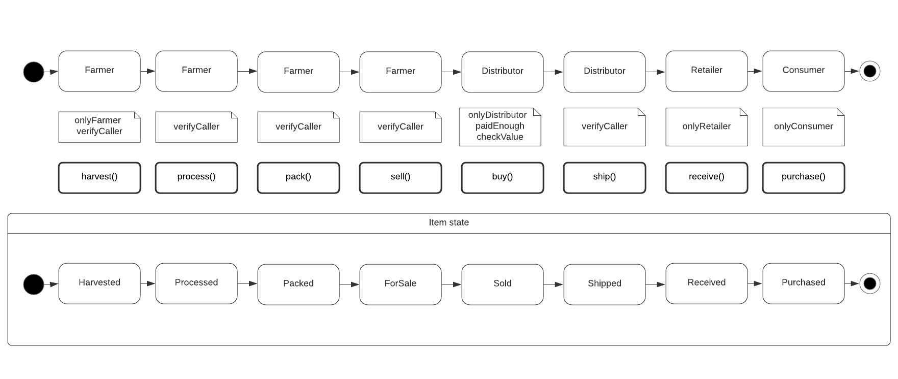
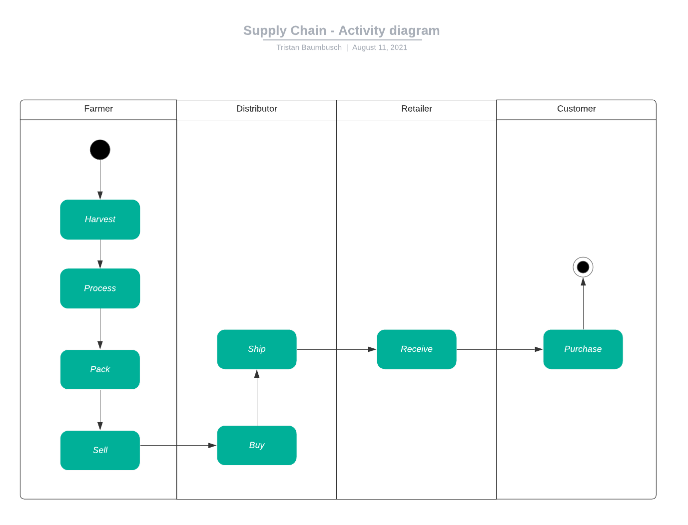
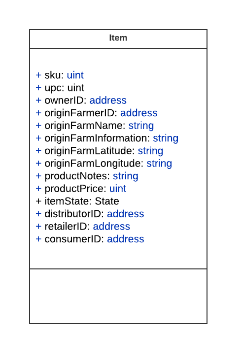
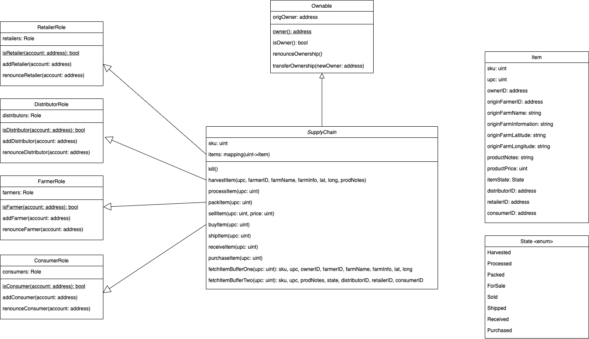
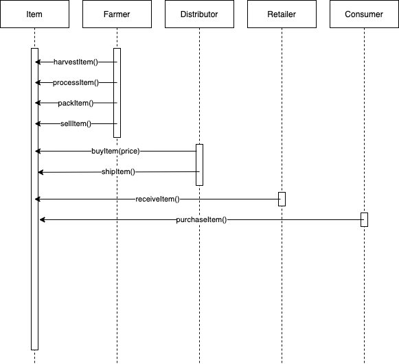

# Supply chain & data auditing

# Description

This repository containts an Ethereum DApp that demonstrates a Supply Chain flow between a Seller and Buyer. The user story is similar to any commonly used supply chain process. A
Seller can add items to the inventory system stored in the blockchain. A Buyer can purchase such items from the inventory system. Additionally a Seller can mark an item as Shipped,
and similarly a Buyer can mark an item as Received.

# UML diagrams

## State diagram



## Activity diagram



## Datamodel



## Class diagram



## Sequence diagram



# Deploying and running locally

After running the *truffle develop* command you have to import some accounts into your Metamask using the secret key provided in the cli of the running node and select the
Localhost 8545 network.

The first account - which deploys the contract - will have all required roles. So if you want to have an easy day, then you can use this account for all actions of the Dapp. If you
want to use another account to interact with the Dapp then you first need to add the required role to the account.

```
npm install -g truffle@5.4.2
git clone git@github.com:tristanessquare/udacity-supply-chain.git
cd udacity-supply-chain
npm install
truffle develop
```

In a new window... at the same file location

```
truffle compile
truffle migrate --network=develop
cd app
npm install
npm run dev
```

Open browser: http://localhost:8080/

# Add roles to account (locally)

To add a role to an account you have to call the corresponding *add*-method. (addFarmer, addRetailer, addDistributor, addConsumer)
Be aware that only an account that already has a role is able to add this role to another account. The owner account of the deployed SupplyChain.sol contract has all roles.

Imagine you want to add the consumer role to the account '0x1dc0687f6d3c6c3bcba7bd4f2bf30137706da221'. The account '0x344d27f0e6f8782d4dea02cc32e76fc3ac8f70a2' already has this
role.

```
truffle console --network=develop
```

In the console...

```
let instance = await SupplyChain.deployed()
await instance.addConsumer('0x1dc0687f6d3c6c3bcba7bd4f2bf30137706da221', {from: '0x344d27f0e6f8782d4dea02cc32e76fc3ac8f70a2'})
```

# Frameworks

- Node:     *16.6.1*
- NPM:      *7.20.3*
- Truffle:  *5.4.2*
- web3:     *1.2.4*
- Metamask: *9.8.4*

## Metamask

Browser wallet plugin that allows to manage your accounts and interact with the Ethereum network. The plugin connects to an Ethereum node and allows to read data (see transactions)
and send data to the network.

## Web3

Collection of Ethereum JavaScript APIs used for communication with the Ethereum network.

## Truffle

Development environment that makes creating, deploying and testing of Dapps and SmartContracts easier. Also includes Ganache, which allows you to locally run an Ethereum network
with one single node.

# IPFS

This Dapp is not hostet on IPFS.

# Rinkeby deployment

- Transaction: *0xc4d544412f0bc23f5a0a6a424def1b26bcd95f66018758dea7c5063a59797174*
- Contract address: *0x5f55C94E8FdE2F79F4FF065A591713b7113fC2E9*
